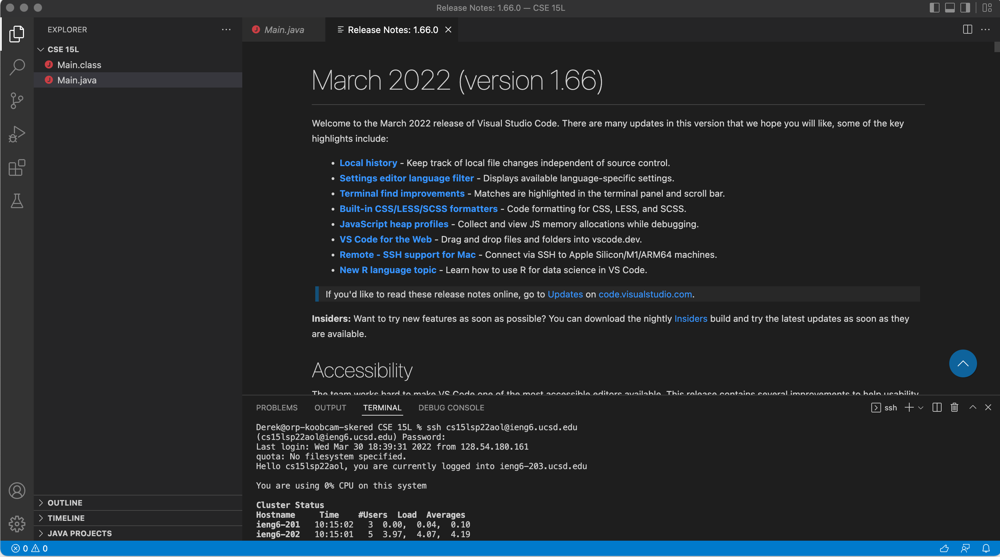
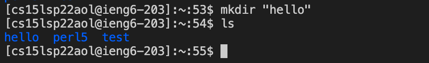
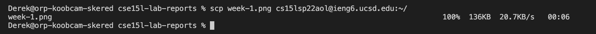
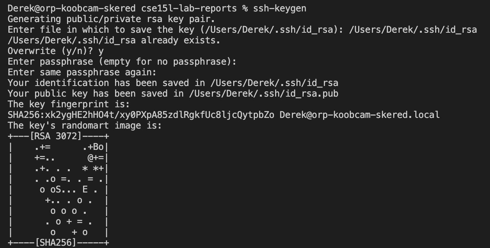
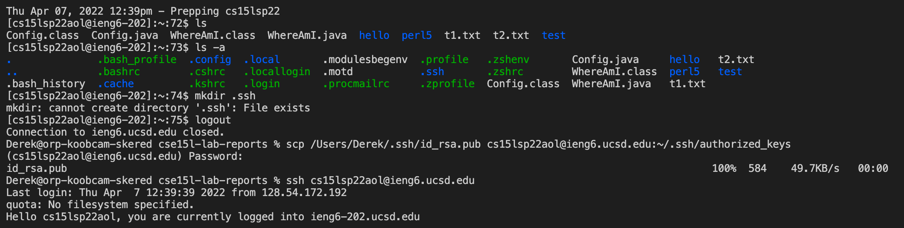
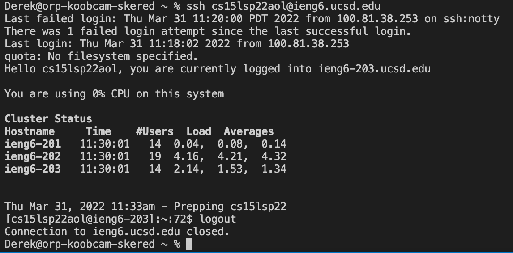
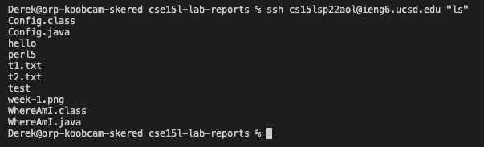
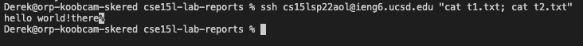
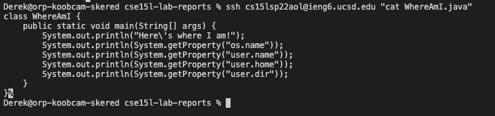

# [Lab Report 1](https://dklopstein.github.io/cse15l-lab-reports/lab-report-1-week-2.html)

## Step 1: Install VSCode

**[Use the Installation](https://code.visualstudio.com)**

Your window should look like this upon first opening

---

## Step 2: Open Terminal and use SSH

1. To open a new terminal go to the top: Terminal > New Terminal or Control-Shift-` (Mac).
2. Then type: `ssh cs15lsp22<account-id>@ieng6.ucsd.edu` 
replace `<account-id>` with your course-specific id.

3. Hit enter and that should prompt you to enter your password. Enter your password and hit enter.
4. Your window should look similar to this after logging in.

---

## Step 3: Test out some commands
These include, but are not limited to:
- `ls`
- `mkdir`
- `cd`
- `cat`

For this example, I used: 

`mkdir <directory-name>`

After creating that directory, if we `ls` you can see the new directory, "hello".

---

## Step 4: Copying files locally
To copy a file locally, we must either know the directory of that file, or be in the directory. A simple way to do this is to open the folder containing the file you want to copy.

1. After opening the folder, use:
`scp \<file to copy> cs15lsp22\<account-id>.ieng6.ucsd.edu:~/`
to copy the file to your server account.

2. You will be prompted to enter a password again.
3. After entering your password, you will see the file name and the transfer rate until it reaches 100%.

*Note: I did not have to enter a password because I have my ssh key saved. This will be shown next.*

---

## Step 5: SSH Keys

1. Enter `ssh-keygen` into terminal.
2. Copy the file path given to generatethe key.
3. Do not enter a passphrase, simply hit "enter" twice.

It should look something like this when done.

*Ignore the overwriting part.*

4. Login using ssh and make a new directory called `.ssh` if it does not exist. Use `mkdir .ssh`.
5. Logout and enter the following: 
`scp /Users/\<username>/.ssh/id_rsa.pub cs15lsp22\<account-id>@ieng6.ucsd.edu:~/.ssh/authorized_keys`
6. Then re-enter your password.

Now anytime you login or try to `scp` directly from your local system, you will not have to enter your password.

It should look something like this.

---

## Optimization for Remote Running

1. You can use quotes and a command at the end of an `ssh` to run it on the server, then exit.

`ssh cs15lsp22<account-id>@ieng6.ucsd.edu "ls"`

2. Using semi-colons `;` enables one to run multiple commands at the same time.

Here I used:

 `ssh cs15lsp22<account-id>@ieng6.ucsd.edu "cat t1.txt; cat t2.txt"`

to read the txt files in my home directory.

3. Using the up-arrow on your keyboard you can recall previously used commands. Using the previous one, I can remove the last command and input a new one. This saves time because you don't need to re-type everything.

