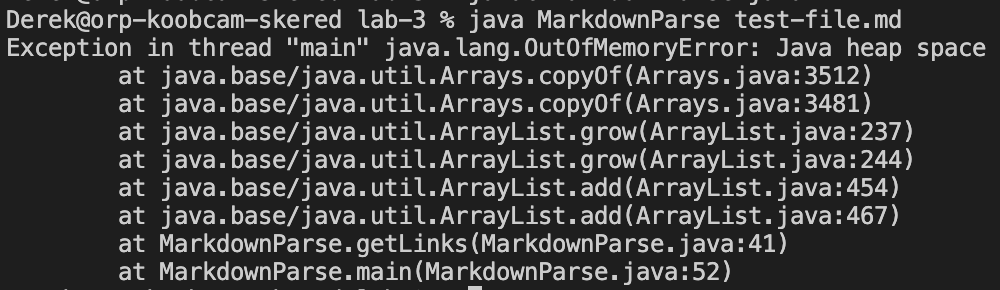

# [Lab Report 2 - Week 4](https://dklopstein.github.io/cse15l-lab-reports/lab-report-2-week-4.html)

### Fixed Blank Space/Extra Text
### Fixed Getting Image Link

**Symptom produced before changes:**

- [test-file.md](https://github.com/dklopstein/lab-3/blob/9dd55af8996ab612f93fec4f09b1c2dc7bbf8afa/test-file.md?plain=1): The failure-induxing input was additional text or spaces after a link, causing an infinite loop. The bug that caused this was from setting the current index to the closed parenthesis index plus one. The problem was if there was additional text, it would continually iterate over the same link, causing this situation.

- [image-test.md](https://github.com/dklopstein/lab-3/blob/119286ba591e7bda35461390241328e88ee0ec4a/image-test.md?plain=1): The failure-inducing input was an exclamation point before the link, meaning an image is supposed to show in markdown, not a link. However, the current implementation, containing the bug, didn't account for this, causing the link to be returned as a symptom. 

---

### Fixed Far Syntax

**Symptom produced before changes:**

- [far-syntax.md](https://github.com/dklopstein/lab-3/blob/24a6906914c731ef48d7e06b4354dbd34db992c4/far-syntax.md?plain=1): The markdown syntax here is wrong, so it shouldn't return a link, but the current implementation still returns the link. The bug is that the code doesn't check the proximity between brackets and parenthesis, so indicies become negligible. This is also what creats the symptom.        

---

### Fixed Missing Bracket

**Symptom produced before changes:**

- [missing-bracket.md](https://github.com/dklopstein/lab-3/blob/4a12530e63ba8ed494f6304d8c1f3f164a235112/missing-bracket.md?plain=1): Although I initially thought I fixed the symptom of accounting for blank spaces and non-existent links, I only had half of the implementation. Therefore, the symptom produced here was an invalid link. The bug was not accounting for other missing syntax when trying to create a link.        
