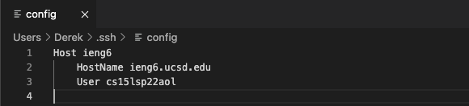
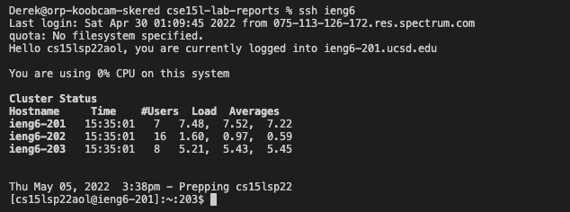
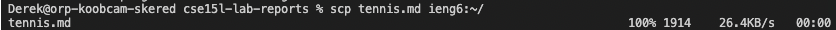
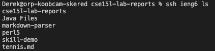
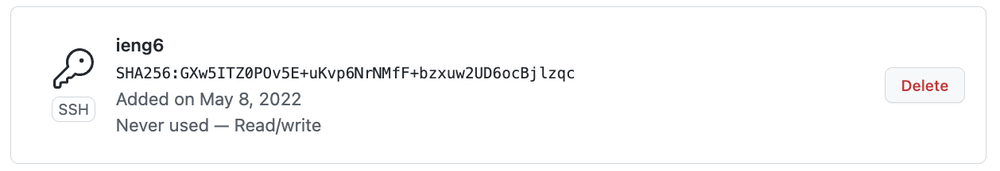
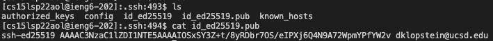
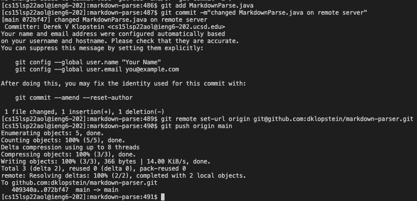
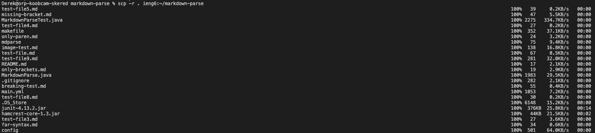
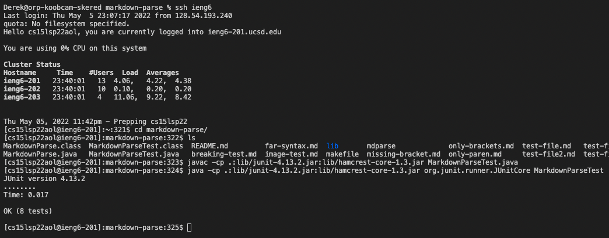
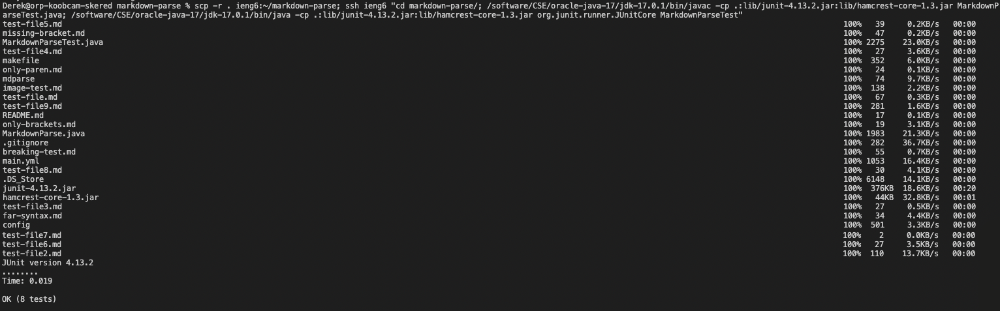

# [Lab Report 3 - Week 6](https://dklopstein.github.io/cse15l-lab-reports/lab-report-2-week-4.html)

## Streamlining SSH Configuration

*config file found in ~/.ssh folder*

The config file enables the user to connect to the server without much difficulty. The alias I chose was `ieng6`, similar to the host name. I edited the config file in [VScode](https://code.visualstudio.com/). To `ssh` I simply type:

`ssh <host>` so in my case: `ssh ieng6`

Since we previously made the ssh keys, we don't have to enter the password either. This makes the process of logging into the host much faster. It also cuts down on time for other commands, for example:

`scp tennis.md ieng6:~/` 

this will copy my tennis.md file from my local repository to my host account.

We can also `ls` without logging in to see if it copied properply:

---

## Setup GitHub Access from ieng6

Public Key on GitHub

Public and Private Keys on Account

By adding your public key on your user account to your GitHub account, you'll be able to commit and push changes to your repository. To make this possible, I typed:

`git remote set-url origin git@github.com:<github account name>/<repository name>.git`

*This changes the remote URL from HTTPS to SSH*

*[Link To Commit](https://github.com/dklopstein/markdown-parser/commit/072bf47cb6775c45df2289657ad35a751c046044)*

In this case, I typed:

`git remote set-url origin git@github.com:dklopstein/markdown-parser.git`

---

## Copying Whole Directories

We can copy whole repositories to our server account using the following:

`scp -r . ieng6:~/markdown-parse`

Now that we have access to our markdown-parse repository on the remote server, we can also run the tests on the remote server.

If we really wanted to, we could also copy the repository to the remote server and tell it to run the tests right after. We accomplish this in one command:

`scp -r . ieng6:~/markdown-parse; ssh ieng6 "cd markdown-parse/; /software/CSE/oracle-java-17/jdk-17.0.1/bin/javac -cp .:lib/junit-4.13.2.jar:lib/hamcrest-core-1.3.jar MarkdownParseTest.java; /software/CSE/oracle-java-17/jdk-17.0.1/bin/java -cp .:lib/junit-4.13.2.jar:lib/hamcrest-core-1.3.jar org.junit.runner.JUnitCore MarkdownParseTest"`

