# [Lab Report 4 - Week 8](https://dklopstein.github.io/cse15l-lab-reports/lab-report-4-week-8.html)

### **[My Implementation](https://github.com/dklopstein/markdown-parser.git)**

### **[Reviewed Implementation](https://github.com/Wei-Ji-Chen/markdown-parser.git)**

## **Snippet 1:**

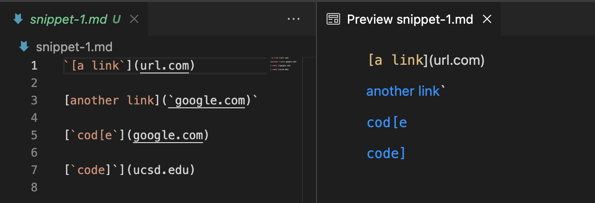

Using VSCode preview to see valid links, it appears the expected output will be:

`[google.com, ucsd.edu]`

Using the expected outcome, we can construct a test for this test file: 

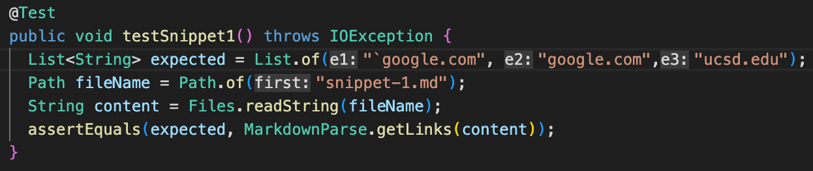

**My Implementation:** did not pass

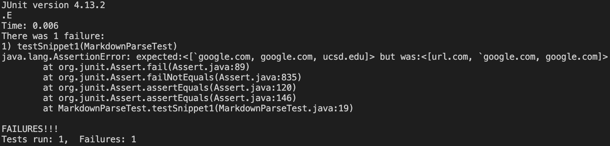

 

**Reviewed Implementation:** did not pass

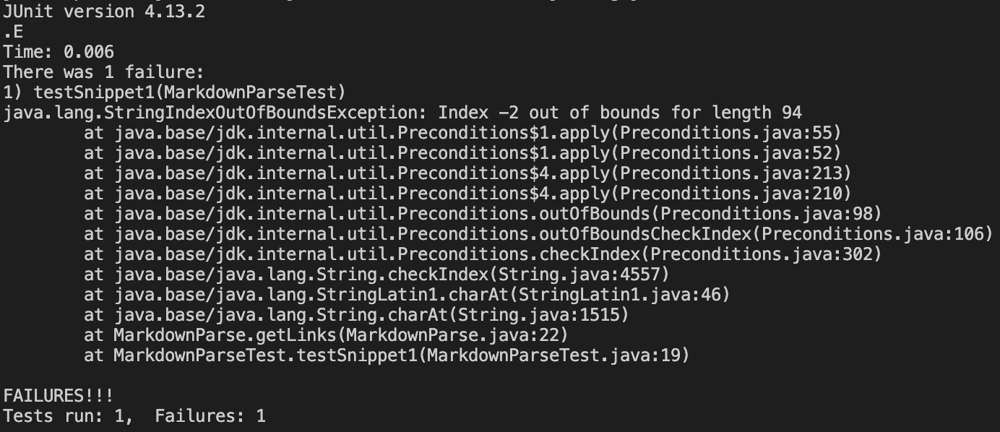

---

## **Snippet 2**

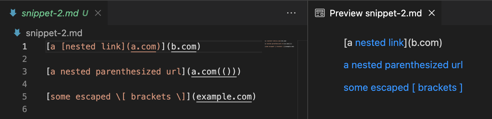

Using VSCode preview to see valid links, it appears the expected output will be:

`[a.com, a.com(()), example.com]`

Using the expected outcome, we can construct a test for this test file: 

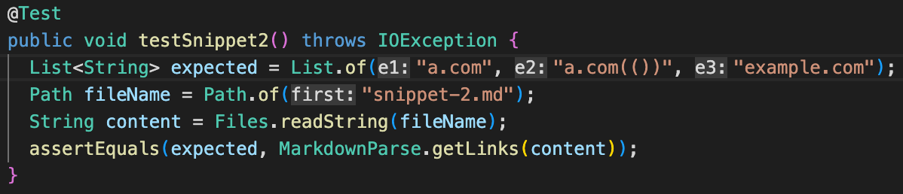

**My Implementation:** did not pass

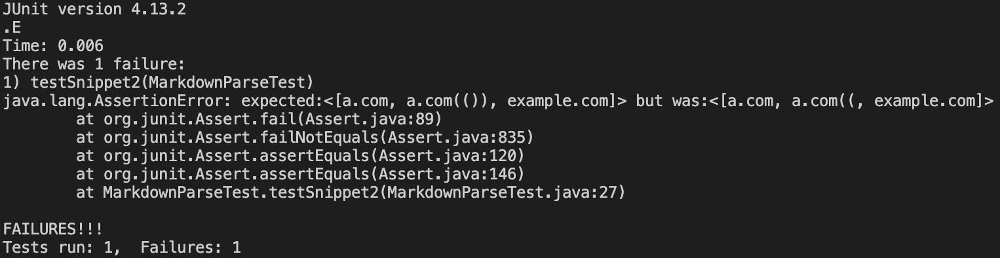

 

**Reviewed Implementation:** did not pass

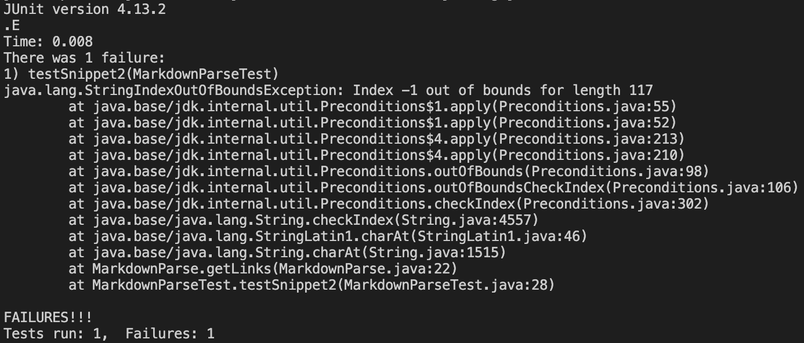

---

## **Snippet 3**

Using VSCode preview to see valid links, it appears the expected output will be:

`[https://sites.google.com/eng.ucsd.edu/cse-15l-spring-2022/schedule]`

Using the expected outcome, we can construct a test for this test file: 

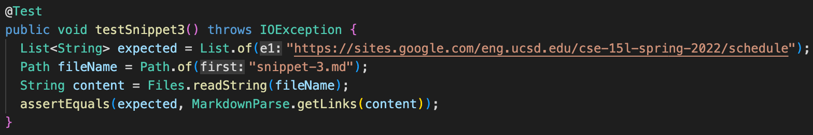

**My Implementation:** did not pass

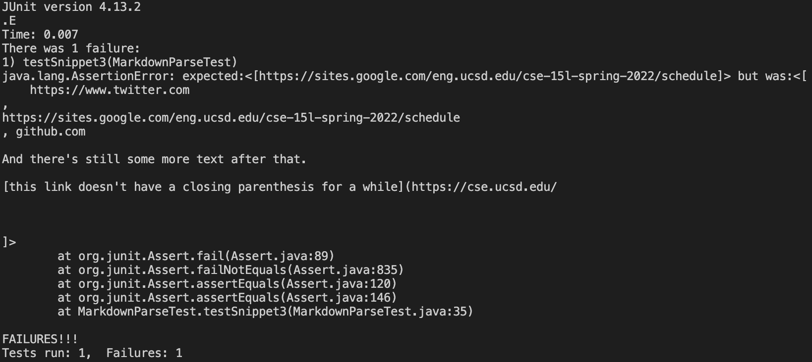

 

**Reviewed Implementation:** did not pass

---

## **Improvement and Debugging**

**Inline Code with Backticks:**

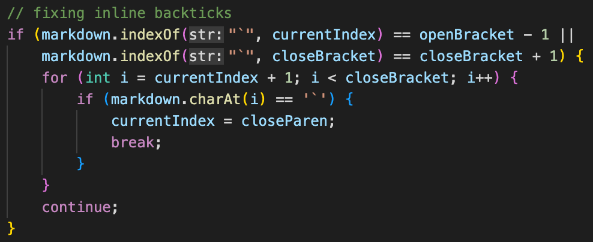

This is my initial idea to fix this problem. It checks if there are any backticks outside the brackets and if there are, it checks for any on the inside (as this makes the link invalid). However, it doesn't work with ``[`code]`](ucsd.edu)`` because of the nested bracket. 

---

**Nested Parenthesis, Brackets, and Escaped Brackets:**

Since my implementation finds two of three valid links, the only problem is the nested parenthesis. Therefore, a simple while loop that checks if the next index after the closed parenthesis is another close parenthesis will solve this problem.

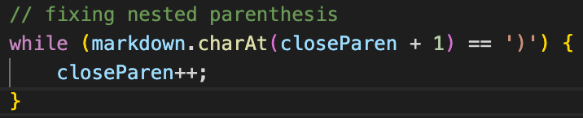

---

**Newlines in Brackets and Parenthesis:**

As I'm unsure of the implementation of finding linebreaks, I'm unsure of how involved it would be to find them. However, with that in mind, I think a possible solution would be finding the number of line breaks between both brackets and parenthesis. Based on the expected output, it seems there can be a max of two lines breaks between them, and if it's greater than that we can skip over it as it would be an invalid link.