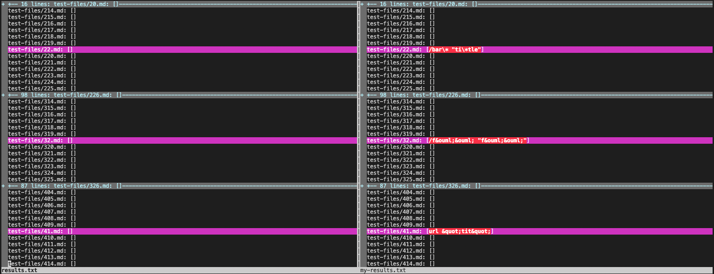
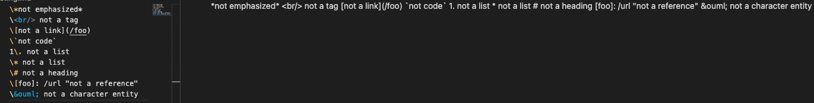
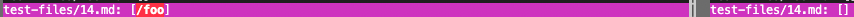
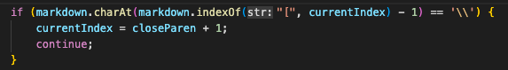
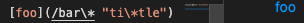
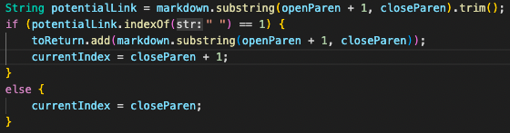

# [Lab Report 5](https://dklopstein.github.io/cse15l-lab-reports/lab-report-5-week-10.html)

## **Identifying Differences Between Implementation Results:**

### **Vimdiff:**

After getting both results from each implementation ushing the script.sh file and running: 

`bash script.sh > results.txt`

I used `vimdiff` to compare the results.

 The left side is the provided implementation and the right is mine.

---

### **[14.md](https://github.com/nidhidhamnani/markdown-parser/blob/main/test-files/14.md?plain=1)**

**Expected:**

Using VSCode:

Since some of the brackets are escaped using `\`, they don't appear as valid links in VSCode. So the expected output should be:

`[]`

 

**Actual:**

The outputs of running the test file with each implementation: 

 Left is provided, right is mine.

Since my implementation returns the expected output, the provided implementation is incorrect for this case.

 

**Bug/Fix:**

The provided implementation doesn't check for escaped brackets or parenthesis. For this case, an if statement checking for escaped brackets (\\ before bracket) should be added before the potential link is checked. This way, the "link" will be invalided.

---

### **[22.md](https://github.com/nidhidhamnani/markdown-parser/blob/main/test-files/22.md)**

**Expected:**

Using VSCode:

Although `foo` appears to be a "valid" link, the parser shouldn't return `[/bar\* "ti\*tle"]` because it's an invalid link. So the expected should be:

`[]`

 

**Actual:**

The outputs of running the test file with each implementation: 

 Left is provided, right is mine.

Since the provided implementation returns the expected output, my implementation is incorrect for this case.

 

**Bug/Fix:**

Before adding the link to the array of links, I should implement an if statement to check if that link is potentially invalid. Here, I borrowed some code from the provided implementation to get the expected output.

